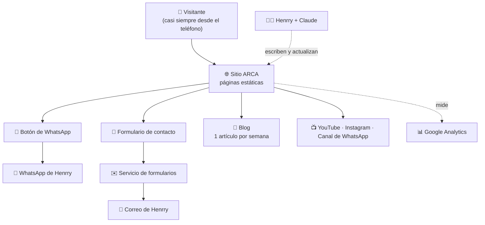

# PRD — ARCA: Aprendizaje en Relaciones Con Amor

**Versión:** 1.0 (borrador)
**Fecha:** 11 de septiembre de 2026
**Responsable:** Henrry Urbina
**Tipo de producto:** Sitio web informativo con captación de consultas y blog

---

## 1. Resumen ejecutivo

ARCA (Aprendizaje en Relaciones Con Amor) es un sitio web sencillo y cálido que presenta el trabajo de acompañamiento de Henrry Urbina en relaciones conscientes, tanto individuales como de pareja. El sitio tiene dos trabajos claros: que la persona que llega **escriba para agendar una sesión**, y que la persona que todavía no está lista **se quede leyendo el blog** hasta que lo esté.

El acompañamiento reúne tres miradas: la **psicoterapia integral** (Gestalt, PNL, constelaciones sistémicas, rebirthing), el **life coaching y el liderazgo personal**, y un eje **psicoespiritual** basado en la visión de *Un Curso de Milagros*. Las sesiones se dan presencialmente en Caracas y en línea para todo el mundo hispanohablante.

El sitio no usa inteligencia artificial de cara al visitante: la experiencia es enteramente humana. Claude se usa por detrás, como herramienta de construcción del sitio y de apoyo a la redacción de artículos y publicaciones que Henrry siempre revisa antes de publicar.

---

## 2. Problema y oportunidad

**El problema de la persona que busca ayuda.** Cuando una pareja entra en crisis, o alguien siente que repite el mismo patrón en todas sus relaciones, lo que hace hoy es preguntar a conocidos, buscar en redes o escribir a cuentas de Instagram. Encuentra mucho contenido suelto y poca gente de confianza. No sabe si quien está del otro lado tiene formación real, si entenderá su forma de ver la vida, ni cómo es una sesión. Ante esa duda, la mayoría no da el paso: pospone.

**El problema de Henrry.** Su trabajo hoy llega casi solo por recomendación de boca en boca. No existe un lugar propio y estable donde alguien pueda conocerlo, entender su enfoque y decidir escribirle. Cada consulta nueva depende de que alguien lo mencione.

**La oportunidad.** Hay un público creciente que busca acompañamiento que integre lo psicológico y lo espiritual, y que no encuentra ese puente: los espacios clínicos suelen dejar fuera lo espiritual, y los espacios espirituales suelen carecer de formación terapéutica. ARCA ocupa exactamente ese lugar. Un sitio propio con blog semanal convierte el boca a boca en algo que se acumula: cada artículo sigue trayendo personas meses después de publicado.

---

## 3. Usuario objetivo

Tres perfiles con el mismo peso. El coaching de liderazgo personal se ofrece como servicio complementario, no como puerta de entrada.

### 💔 Perfil 1 — La pareja en crisis

Personas de 30 a 55 años que llevan meses o años en un conflicto que no se resuelve: discusiones repetidas, distancia afectiva, una infidelidad, o la conversación de separarse ya sobre la mesa. Suele ser **uno de los dos** quien busca ayuda, muchas veces de noche y desde el teléfono, con urgencia emocional. Su pregunta es "¿esto tiene arreglo?". Necesita sentir que hay alguien que no va a tomar partido y que ya ha visto casos como el suyo.

### 🌱 Perfil 2 — La persona en proceso individual

Personas de 25 a 50 años, frecuentemente con alguna experiencia previa de terapia o crecimiento personal. Están solteras, recién separadas o dentro de una relación que las incomoda. Notan que repiten un patrón: eligen mal, se anulan, no logran sostener el vínculo. Su pregunta es "¿qué me pasa a mí en las relaciones?". Buscan profundidad, no consejos rápidos.

### ✨ Perfil 3 — El buscador psicoespiritual

Personas de 35 a 65 años, lectoras de *Un Curso de Milagros* o de caminos afines. Ya trabajan en sí mismas y buscan a alguien que aterrice el Curso en lo cotidiano: el perdón dentro del matrimonio, los resentimientos familiares, el conflicto real. Su pregunta es "¿cómo vivo esto de verdad en mis vínculos?". Valoran la coherencia del acompañante por encima de sus títulos.

**Quién paga.** La misma persona que consulta. En el caso de las parejas, suele pagar quien tomó la iniciativa de buscar ayuda.

---

## 4. Propuesta de valor

> **"Un espacio donde tus relaciones se sanan desde adentro: la profundidad de la terapia, la claridad del coaching y la mirada del amor de Un Curso de Milagros, con una sola persona que te acompaña."**

Lo que hace distinto a ARCA:

| | Qué ofrece ARCA |
|---|---|
| **Integración real** | Una sola persona reúne terapia Gestalt, PNL, constelaciones sistémicas, rebirthing, dinámica de grupos, mediación de conflictos y UCDM. La persona no tiene que elegir entre "lo psicológico" y "lo espiritual". |
| **Especialización en el vínculo** | El foco no es la salud mental en general, sino la relación: la de pareja y la que cada quien tiene consigo mismo. |
| **Trabajo con el conflicto** | La formación en mediación y transformación del conflicto y en pedagogía para la paz hace de las crisis el terreno natural de trabajo, no la excepción. |
| **Acceso sin barreras** | Presencial en Caracas y en línea para cualquier país hispanohablante, con un primer contacto simple por WhatsApp. |
| **Contenido que acompaña antes de decidir** | Un artículo por semana permite conocer la mirada de ARCA sin compromiso, hasta que la persona se sienta lista. |

**La promesa al visitante:** en menos de un minuto en el sitio, sabe si este es su lugar y sabe exactamente qué hacer para dar el primer paso.

---

## 5. Casos de uso principales

### CU-1 — La pareja en crisis pide ayuda (prioridad máxima)

- **Actor:** una persona cuya relación está en crisis.
- **Disparador:** una discusión fuerte, una infidelidad descubierta, o la palabra "separación" dicha en voz alta. Busca en Google "terapia de pareja Caracas" o ve una publicación de Instagram.
- **Pasos:** llega al Inicio → reconoce su situación en la puerta "Mi relación está en crisis" → lee qué pasa en una sesión de pareja y quién es Henrry → toca el botón de WhatsApp → escribe.
- **Resultado:** Henrry recibe un mensaje con contexto mínimo y coordina una primera sesión.
- **Requisito verificable:** desde el Inicio, llegar al botón de WhatsApp toma **2 clics como máximo**.

### CU-2 — La persona en proceso individual explora antes de decidir

- **Actor:** alguien que sospecha que repite un patrón en sus relaciones.
- **Disparador:** una ruptura, o un artículo de ARCA que le llegó por redes.
- **Pasos:** entra al blog → lee un artículo → se identifica → entra a "Nosotros" para saber quién escribe → revisa Servicios → escribe por el formulario o por WhatsApp, o se suscribe al canal de WhatsApp para seguir leyendo.
- **Resultado:** una consulta, o una persona que se queda en la comunidad y consulta semanas después.
- **Requisito verificable:** **todo** artículo del blog termina con una invitación visible a agendar y otra a unirse al canal.

### CU-3 — El buscador de UCDM encuentra a alguien que lo aterriza

- **Actor:** lector o estudiante de *Un Curso de Milagros*.
- **Disparador:** busca contenido sobre perdón, relaciones santas o resentimiento, o ve un video de YouTube.
- **Pasos:** llega por un artículo o video → entra a la puerta "Busco vivir Un Curso de Milagros" → ve que Henrry es Maestro de UCDM **y** psicoterapeuta → escribe.
- **Resultado:** una consulta de acompañamiento psicoespiritual.
- **Requisito verificable:** la condición de Maestro de UCDM aparece en el Inicio, sin necesidad de entrar a "Nosotros".

### CU-4 — Henrry publica un artículo semanal

- **Actor:** Henrry.
- **Disparador:** su rutina semanal de publicación.
- **Pasos:** elige el tema del eje que toca esa semana (pareja / individual / UCDM) → trabaja el artículo con Claude a partir de sus ideas → lo revisa y corrige → lo publica → Claude convierte el artículo en publicaciones para Instagram y en un mensaje para el canal de WhatsApp.
- **Resultado:** un artículo nuevo en el sitio y contenido para redes.
- **Requisito verificable:** publicar un artículo ya redactado toma **menos de 15 minutos** y no requiere ayuda técnica.

### CU-5 — Alguien quiere saber precios y modalidades antes de escribir

- **Actor:** cualquiera de los tres perfiles.
- **Disparador:** interés real, con una duda práctica de por medio.
- **Pasos:** entra a Servicios → ve duración, modalidad (presencial en Caracas o en línea) y cómo se coordina el pago.
- **Resultado:** escribe con menos dudas, o se retira sin ocupar tiempo de Henrry.
- **Requisito verificable:** la página de Servicios responde **duración, modalidad y forma de coordinar el pago** para cada servicio.
- **TBD:** si se muestran o no los precios en el sitio. Supuesto por defecto: no se publican; se indica "consultar por WhatsApp", que es lo habitual en Venezuela por la variación cambiaria.

---

## 6. Recorrido del usuario

### Camino feliz

1. **Llega** por Google, por un video de YouTube, por Instagram o por recomendación.
2. **Reconoce su situación** en los primeros 5 segundos, gracias a las tres puertas del Inicio.
3. **Entiende la propuesta**: quién es Henrry, qué enfoque tiene, cómo es una sesión.
4. **Confía**: ve las credenciales, el tono de los artículos y testimonios (cuando los haya).
5. **Actúa**: toca WhatsApp o llena el formulario.
6. **Recibe respuesta** de Henrry y agenda.

### Cuando algo no sale bien

| Situación | Qué hace el sitio |
|---|---|
| La persona no se identifica con ninguna de las tres puertas | Existe una cuarta vía discreta: "No sé por dónde empezar", que lleva a una página breve con una invitación a escribir y contarlo en sus palabras. |
| Llega fuera de horario o en fin de semana | El formulario y WhatsApp indican el tiempo de respuesta esperado (supuesto: **24 horas hábiles**) para que nadie quede esperando sin saber. |
| La persona está en una situación de riesgo (violencia, pensamientos de hacerse daño) | Un aviso visible y sereno en Contacto y al pie del sitio aclara que ARCA **no es un servicio de emergencia** e indica acudir a servicios de emergencia o a una línea de ayuda. |
| El formulario falla | Aparece un mensaje claro de error con el WhatsApp como alternativa inmediata. Nunca se pierde el contacto en silencio. |
| La persona busca algo que ARCA no ofrece (psiquiatría, medicación, terapia infantil) | La página de Servicios dice explícitamente **qué no se atiende**, para no generar falsas expectativas. |
| Entra desde un teléfono con conexión lenta | El sitio carga en **menos de 3 segundos** en 4G, con imágenes livianas. La mayoría del tráfico será móvil. |

---

## 7. Qué hace la IA

**En el sitio, de cara al visitante: nada.** No hay chatbot, ni asistente, ni respuestas automáticas. Todo contacto es humano y directo con Henrry. Esta es una decisión consciente: en temas de crisis emocional, un intermediario automático resta confianza y genera riesgos.

**Detrás de escena, con Henrry:**

| | |
|---|---|
| **Qué recibe Claude** | Las ideas de Henrry: un tema, unas notas sueltas, un audio transcrito, una experiencia de consulta contada sin datos identificables. |
| **Qué produce** | Borradores de artículos, textos del sitio, títulos, publicaciones para Instagram, mensajes para el canal de WhatsApp, guiones para videos de YouTube. Además, el código y el diseño del sitio. |
| **Qué NO debe hacer** | No publica nada por su cuenta: todo pasa por la revisión y aprobación de Henrry. No inventa casos clínicos ni testimonios. No usa información identificable de clientes reales. No cita textualmente *Un Curso de Milagros* más allá de frases breves con su referencia. No suplanta la voz de Henrry: escribe borradores que él ajusta hasta que suenen suyos. |

**Costo:** como la IA no corre dentro de la página, el sitio **no genera costo de IA por visita**. El único uso es el de Henrry desde su suscripción a Claude.

---

## 8. Construibilidad con Claude

### ✅ Lo que se construye con Claude, sin conocimiento técnico

- El sitio completo: estructura, diseño visual, textos y código de las cinco secciones.
- La adaptación a teléfono, tableta y computadora.
- El sistema del blog y el formato de los artículos.
- Los textos de cada página, los avisos legales y de privacidad.
- Los artículos del blog y el contenido para redes, semana a semana.
- Las instrucciones paso a paso para publicar y actualizar el sitio.

### 🔌 Lo que requiere servicios externos (gratuitos o muy baratos, sin programar)

| Qué | Para qué | Costo | Dificultad |
|---|---|---|---|
| **Dominio** (ej. arca-relaciones.com) | La dirección del sitio | ~$15 al año | Baja: se compra y se conecta siguiendo instrucciones |
| **Alojamiento** (Netlify o similar) | Que el sitio esté en internet | Gratis | Baja: se arrastra una carpeta y queda publicado |
| **Servicio de formularios** (Netlify Forms o Formspree) | Que el formulario llegue al correo | Gratis hasta ~50 envíos al mes | Baja: se activa con una línea que Claude deja lista |
| **Google Analytics** | Saber cuánta gente visita y de dónde llega | Gratis | Media: hay que crear la cuenta y pegar un código |
| **Cuenta de correo propia** (opcional) | Recibir las consultas en algo como hola@arca... | ~$0–6 al mes | Baja |

### ⚠️ Lo que queda fuera de esta versión y por qué

| Qué | Por qué | Qué se hace en su lugar |
|---|---|---|
| **Cobro en línea** | Requiere pasarela de pago, y en Venezuela tiene restricciones particulares | Se coordina el pago por WhatsApp, como hoy |
| **Calendario de reservas automático** | Requiere un servicio externo y mantener la agenda al día | Se coordina el horario por WhatsApp |
| **Área privada de alumnos o cursos** | Requiere cuentas de usuario, contraseñas y protección de contenido: es otro producto | Se evalúa cuando los cursos existan |
| **Chat con IA** | Decisión de producto: riesgo alto en temas sensibles | Contacto humano directo |
| **Feed de Instagram en vivo** | Requiere un servicio externo y se rompe con los cambios de Instagram | Enlaces e iconos a las redes |
| **Videollamadas dentro del sitio** | Requiere infraestructura de video | Zoom, Meet o WhatsApp, como hoy |

**Si más adelante quisieras el sitio completo** (pagos, reservas automáticas, cursos con acceso privado), eso ya requiere apoyo en desarrollo web, integraciones de pago y manejo de bases de datos. No es un camino cerrado: es un segundo paso que conviene dar cuando el primero ya esté trayendo clientes.

---

## 9. Alcance de la primera versión (MVP)

Esfuerzo: **R** = rápido (menos de 1 día) · **M** = medio (1 a 3 días) · **G** = grande (más de 3 días).

### MUST — sin esto el sitio no sirve

| # | Qué | Esfuerzo |
|---|---|---|
| M1 | **Inicio** con la frase de valor, las tres puertas (crisis de pareja / proceso individual / UCDM) y la cuarta vía "No sé por dónde empezar" | M |
| M2 | **Nosotros**: tu historia, tu enfoque integral, tus credenciales y una foto tuya | M |
| M3 | **Servicios**: cuatro acompañamientos (individual, pareja, psicoespiritual y coaching de liderazgo), con duración, modalidad, qué NO se atiende y cómo se coordinan las tarifas | M |
| M4 | **Blog** con 4 artículos iniciales y estructura para ir sumando uno por semana | G |
| M5 | **Contacto** con formulario (nombre, correo o WhatsApp, tipo de sesión, modalidad, motivo breve y opcional, "¿cómo llegaste a ARCA?") | M |
| M6 | **Botón de WhatsApp** flotante en todas las páginas, con mensaje inicial ya escrito | R |
| M7 | **Versión móvil** impecable: es de donde vendrá la mayoría del tráfico | M |
| M8 | **Identidad visual**: logo de ARCA (sello circular morado con ondas), paleta definida en el anexo A y tipografía amable | M |
| M9 | **Enlaces a YouTube, Instagram y canal de WhatsApp** en el encabezado o el pie | R |
| M10 | **Avisos**: confidencialidad, "no es un servicio de emergencia" y aviso de privacidad | R |
| M11 | **Dominio propio y sitio publicado** | M |
| M12 | **Google Analytics** instalado desde el primer día | R |

### SHOULD — mejora mucho, pero puede esperar a la semana 3 o 4

| # | Qué | Esfuerzo |
|---|---|---|
| S1 | Testimonios de clientes (anónimos o con permiso escrito) | R |
| S2 | Sección de preguntas frecuentes: cómo es una sesión, cuánto dura un proceso, confidencialidad | M |
| S3 | Textos preparados para buscadores ("terapia de pareja Caracas", "terapia de pareja en línea") | M |
| S4 | Videos de YouTube insertados en Inicio y en el blog | R |
| S5 | Página propia para cada una de las tres puertas, en vez de secciones dentro del Inicio | M |

### COULD — cuando el sitio ya esté trayendo consultas

Boletín por correo · buscador dentro del blog · versión en inglés · galería de talleres presenciales · agenda de eventos.

### NO POR AHORA — decidido conscientemente

Cobros en línea · calendario de reservas automático · área privada de alumnos o cursos · chat con IA · foro o comunidad dentro del sitio · aplicación móvil.

---

## 10. Cómo se construye, en simple

El sitio es un **sitio estático**: un conjunto de páginas ya escritas que se entregan tal cual al visitante. Piénsalo como un folleto muy bien hecho, en vez de una máquina con engranajes. Por eso es rápido, casi imposible de romper, no necesita mantenimiento técnico y cuesta prácticamente nada alojar.

Para publicar un artículo nuevo: le pides a Claude el artículo, lo revisas, Claude te devuelve la página lista y tú la subes al alojamiento arrastrando una carpeta. Sin bases de datos, sin contraseñas de administrador, sin actualizaciones de seguridad.

**Las piezas, una por una:**

| Pieza | Qué es, en simple | Costo |
|---|---|---|
| Dominio | La dirección que la gente escribe | ~$15 al año |
| Netlify | El "terreno" donde vive el sitio | Gratis |
| Netlify Forms o Formspree | El cartero que lleva el formulario a tu correo | Gratis hasta ~50 mensajes al mes |
| Google Analytics | El contador de visitas | Gratis |
| Claude | Quien construye y escribe contigo | Tu suscripción actual |

**Costo total estimado del primer año: entre $15 y $90**, según si contratas o no un correo propio.

---

## 11. Métricas de éxito

**⭐ Métrica estrella:** clientes nuevos que llegaron gracias al sitio.

| Métrica | Cómo se mide | Línea base | Meta a 90 días |
|---|---|---|---|
| ⭐ **Clientes nuevos atribuidos al sitio** | Preguntando a cada cliente nuevo "¿cómo llegaste a ARCA?" y anotándolo | 0 (el sitio no existe) | **4 al mes** (pasar de ~12 a ~16 clientes mensuales) |
| **Consultas recibidas** | Mensajes de WhatsApp desde el botón + envíos del formulario | 0 | **12 al mes** |
| **Suscriptores de YouTube** | Panel de YouTube | TBD: anotar el número el día del lanzamiento | **+300** respecto a la línea base |
| **Visitantes del sitio** | Google Analytics | 0 | **500 visitantes al mes** |
| **Constancia del blog** | Artículos publicados | 0 | **12 artículos** publicados en 90 días (1 por semana) |

**Cómo leer los resultados a los 90 días:**

- Muchas visitas y pocas consultas → el problema está en los textos o en la llamada a la acción.
- Pocas visitas y buena proporción de consultas → el sitio convence, falta que la gente llegue: hay que empujar redes y buscadores.
- Ambas bajas → revisar de dónde viene el tráfico antes de tocar el sitio.

---

## 12. Riesgos y cómo evitarlos

| Riesgo | Probabilidad | Qué hacer |
|---|---|---|
| **El blog semanal se abandona al mes y medio** | Alta | Salir con 4 artículos ya publicados y escribir el siguiente con una semana de anticipación. Trabajar con Claude en bloques: 3 artículos en una sesión, publicados de a uno. |
| **Muchas visitas, cero consultas** | Media | Botón de WhatsApp siempre visible, cierre con invitación en cada artículo, y textos que hablen del dolor de la persona antes que de tus títulos. |
| **Llega gente buscando algo que no atiendes** (psiquiatría, medicación, terapia infantil) | Media | Decirlo explícitamente en Servicios y tener una respuesta breve de derivación lista. |
| **Una persona en riesgo escribe por el formulario y espera respuesta inmediata** | Media | Aviso visible de que no es un servicio de emergencia, tiempo de respuesta declarado y mensaje automático de recepción. |
| **Datos sensibles en el formulario** | Media | Pedir lo mínimo, marcar el motivo como opcional y breve, aviso de confidencialidad, y no guardar los mensajes en ningún lugar público. Responder desde un correo al que solo tú accedes. |
| **Uso indebido de textos de *Un Curso de Milagros*** | Media | Contenido original tuyo; citas breves y siempre con su referencia. No reproducir lecciones completas. |
| **Exceso de credenciales que abruma al visitante** | Alta | Una frase central arriba y las certificaciones como respaldo, más abajo, en una lista ordenada. |
| **El sitio se ve mal en el teléfono** | Media | Probarlo en tu propio teléfono antes de publicar, y pedirle a 3 personas que lo abran y te digan qué entienden. |
| **Se dilata el lanzamiento buscando la perfección** | Alta | Fecha fija de publicación. Un sitio vivo e imperfecto vale más que uno perfecto sin publicar. |
| **Fotos o logo de baja calidad** | Media | Una sesión de fotos sencilla con buena luz natural resuelve el 80% de la percepción de profesionalidad. |

---

## 13. Plan 30 / 60 / 90 días

### Días 1 a 30 — Construir y publicar

**Semana 1:** decidir el nombre del dominio y comprarlo · reunir el logo, 2 o 3 fotos tuyas y tus enlaces de redes · con Claude, escribir el texto de Inicio y de Nosotros.
**Semana 2:** definir Servicios (duración, modalidad, qué no atiendes) · construir el sitio con Claude · armar el formulario y el botón de WhatsApp.
**Semana 3:** escribir los 4 artículos iniciales, uno por eje más la presentación de ARCA · revisar en el teléfono · pedir opinión a 3 personas de confianza.
**Semana 4:** publicar el sitio · instalar Google Analytics · anunciarlo en Instagram, YouTube y el canal de WhatsApp · anotar la línea base de suscriptores.

**Al día 30:** sitio en línea, 4 artículos publicados, canales conectados.

### Días 31 a 60 — Alimentar y ajustar

Un artículo por semana, sin excepción · convertir cada artículo en publicaciones para Instagram y en un mensaje para el canal · un video de YouTube al mes sobre el artículo más leído · sumar preguntas frecuentes y los primeros testimonios · preguntar a cada consulta cómo llegó · revisar Analytics una vez por semana y ajustar el texto de las páginas menos efectivas.

**Al día 60:** 8 artículos, primeras consultas llegando, primeros ajustes hechos con datos.

### Días 61 a 90 — Medir y decidir

Sostener el ritmo semanal · medir contra las metas · trabajar el posicionamiento en buscadores para "terapia de pareja Caracas" y "terapia de pareja en línea" · evaluar tres decisiones: si conviene un calendario de reservas, si empezar a mostrar precios y si abrir la línea de talleres.

**Al día 90:** 12 artículos, métricas medidas y una decisión clara sobre la segunda versión del sitio.

---

## 14. Pendientes por confirmar (TBD)

| # | Pendiente | Supuesto por defecto mientras tanto | Cuándo resolverlo |
|---|---|---|---|
| T1 | Nombre exacto del dominio | `arcarelaciones.com` o similar, según disponibilidad | Semana 1 |
| T2 | ~~¿Se muestran los precios en el sitio?~~ | **Resuelto.** No se publican: "consultar por WhatsApp", con una línea que menciona opciones para distintas posibilidades | ✅ Cerrado |
| T3 | ¿Existen ya las cuentas de YouTube, Instagram y el canal de WhatsApp? | Hay que crearlas o terminar de configurarlas | Semana 1 |
| T4 | Número de suscriptores de YouTube el día del lanzamiento | Se anota como línea base al publicar | Día del lanzamiento |
| T5 | Tiempo de respuesta que se promete en el sitio | 24 horas hábiles | Semana 2 |
| T6 | ~~Duración y formato de cada tipo de sesión~~ | **Resuelto.** Individual 90 min · Pareja 90 min · Psicoespiritual 60 min · Coaching 60 min | ✅ Cerrado |
| T7 | Rangos de edad y detalles de los tres perfiles | Los descritos en el segmento 3 | Contrastar con tus clientes actuales |
| T8 | ¿Se muestra dirección del consultorio en Caracas? | Solo la zona, sin dirección exacta | Semana 2 |
| T9 | Correo de contacto | Uno personal al inicio; correo propio del dominio más adelante | Semana 1 |
| T10 | ~~Colores exactos de la paleta~~ | **Resuelto.** Ver anexo A | ✅ Cerrado |

---

## 15. Primeros pasos con Claude

Cinco acciones concretas para empezar a construir. Las tres primeras se pueden hacer hoy mismo.

**1. Prepara el material (30 minutos, sin Claude).**
Reúne: el archivo del logo, 2 o 3 fotos tuyas con buena luz natural, tu número de WhatsApp, los enlaces de tus redes y una lista de las certificaciones tal como quieres que aparezcan escritas.

**2. Pídele a Claude los textos, antes que el sitio.**
> "Con base en el PRD de ARCA, escríbeme el texto de la página de Inicio: la frase principal, las tres puertas de entrada y una presentación breve de mí. Tono cálido y cercano, sin jerga terapéutica. Dame 2 versiones para elegir."

Repite lo mismo para Nosotros y Servicios. **Los textos son el verdadero trabajo**; el sitio es el envase.

**3. Pídele a Claude el sitio completo.**
> "Con el PRD de ARCA y los textos que ya aprobamos, constrúyeme el sitio completo: Inicio, Nosotros, Servicios, Blog y Contacto. Paleta cálida en tonos suaves, con el logo que te comparto. Botón de WhatsApp flotante, formulario de contacto y versión móvil impecable. Explícame paso a paso cómo publicarlo."

**4. Escribe los 4 artículos iniciales en una sola sesión.**
Uno por cada eje (pareja, individual, UCDM) más uno de presentación de ARCA. Dale a Claude tus ideas en crudo, incluso dictadas, y pídele que las convierta en artículos con tu voz. Corrígelos hasta que suenen tuyos: el blog debe sonar a ti, no a una IA.

**5. Prueba con personas reales antes de anunciarlo.**
Muéstrale el sitio a 3 personas que se parezcan a tus tres perfiles, desde el teléfono, sin explicarles nada. Pregúntales: ¿qué hace esta persona?, ¿para quién es esto?, ¿qué harías si quisieras una sesión? Si las tres responden bien, el sitio está listo para publicarse.

---

*Documento elaborado el 11 de septiembre de 2026. Versión 1.0, aprobada segmento por segmento por Henrry Urbina.*

---

## Anexo A — Identidad visual

**Logo.** Sello circular en morado sobre fondo blanco: la palabra ARCA en mayúsculas, un trazo de ondas debajo que sugiere agua y movimiento, y el nombre completo "Aprendizaje en Relaciones con Amor" rodeando el círculo. Formato cuadrado, lo que lo hace ideal para foto de perfil en redes.

**Nota de criterio.** El morado del logo es un color frío, mientras que la identidad buscada para ARCA es cálida y suave. Se resuelve así: **el morado aporta la identidad y la seriedad profesional; el calor lo aporta el fondo**. El sitio nunca usa blanco puro como fondo, sino crema.

### Paleta

| Nombre | Código | Uso |
|---|---|---|
| Morado ARCA | `#58227A` | Logo, títulos, botones principales, encabezado |
| Morado suave | `#8B5FA8` | Enlaces, subtítulos, detalles |
| Crema cálido | `#FAF6F0` | Fondo general de todo el sitio |
| Arena | `#EDE3D6` | Tarjetas, separadores, bordes |
| Terracota | `#B4643F` | Acento cálido: botón de WhatsApp y llamadas a la acción secundarias |
| Lavanda pálido | `#F3EDF7` | Fondo de secciones destacadas y citas |
| Texto principal | `#3A2E38` | Todo el texto de lectura (marrón violáceo, más cálido que el negro) |

### Reglas de uso

- **Nunca usar blanco puro (`#FFFFFF`) como fondo de página.** El fondo es siempre crema `#FAF6F0`.
- El **morado** manda en títulos y en el botón principal ("Agenda tu sesión").
- La **terracota** se reserva para el botón de WhatsApp y acentos: si aparece en todas partes, pierde fuerza.
- Todo texto de lectura va en `#3A2E38` sobre crema, nunca morado sobre morado ni texto claro sobre terracota.
- **Tipografía sugerida:** una serif amable para los títulos (Lora o Cormorant Garamond) y una sans legible para el texto (Inter o Source Sans). Ambas son gratuitas.
- **Fotografía:** luz natural, tonos tierra, personas reales. Evitar fotos de banco de imágenes con parejas sonriendo artificialmente: restan credibilidad justo en el momento en que la persona está decidiendo si confiar.
